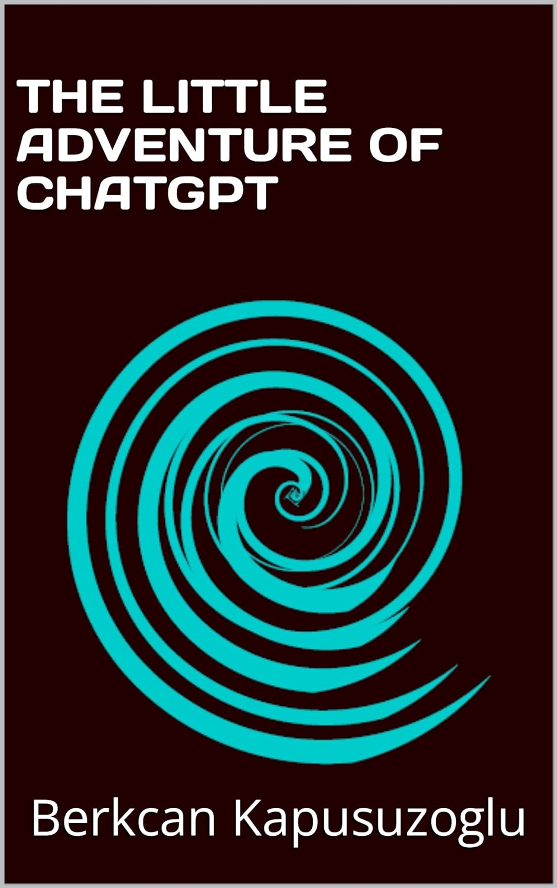

<!-- # Introduction

This is my first blog post!

## Subsection

Here's some more information about my topic.

### Another Level

You can have many levels of headers.

## Images

You can include images in your post. Make sure the image file is located in the correct directory.

!Alt text for image

## Lists

You can create lists using dashes for unordered lists:

- Item 1
- Item 2
- Item 3

Or numbers for ordered lists:

1. First item
2. Second item
3. Third item

## Links

You can create links like this: Link text

## Conclusion

That's all for now. Stay tuned for more posts!

 -->

I have just published my first books on Amazon.com. 

The first child book "The Little Adventure of ChatGPT" is about the adventure of ChatGPT. It is fully generated by the infamaous ChatGPT iself!

<!--  -->

<!--  -->

&nbsp;

**Whisper of the Bosphorus:** https://www.amazon.com/dp/B0CNX5Z56P

**THE LITTLE ADVENTURE OF CHATGPT:** https://www.amazon.com/dp/B0CNWNKDZ6